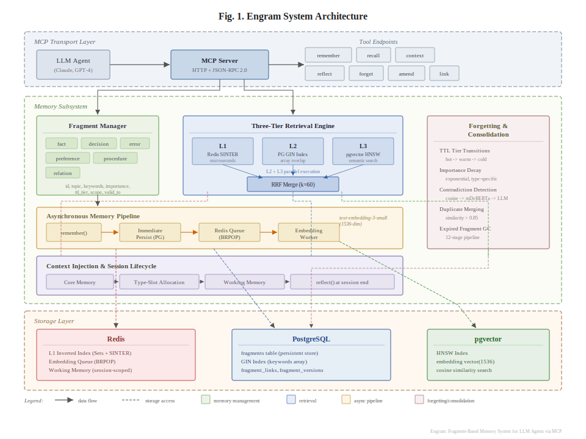

# Engram Codex

**Codex app/CLI 워크플로를 위한 fragment-based memory MCP server.**

Engram Codex는 MCP(Model Context Protocol) 기반 에이전트를 위한 **장기 기억 서버**입니다. Codex app과 CLI에서 같은 기억 흐름을 재사용할 수 있도록, 중요한 사실, 결정, 에러 패턴, 선호, 절차를 **파편(fragment)** 단위로 저장하고 다음 세션에서 필요한 기억만 다시 꺼내 쓸 수 있게 합니다.

**빠른 링크**

- [설치 가이드](INSTALL.md)
- [영문 README](README.en.md)
- [서드파티 고지](THIRD_PARTY_NOTICES.md)
- [라이선스](LICENSE)

> [!NOTE]
> 이 저장소는 Apache-2.0 기반 코드베이스를 Codex 중심 워크플로에 맞게 재구성한 파생 저장소다. 출처 및 변경 고지는 [THIRD_PARTY_NOTICES.md](THIRD_PARTY_NOTICES.md)에 정리했다.

---

## 왜 Engram Codex인가

긴 대화 요약을 통째로 저장하면 다음 문제가 생깁니다.

- 관련 없는 정보까지 함께 다시 불러오게 됨
- 오래된 정보와 최신 정보가 충돌함
- 필요한 기억만 정확하게 꺼내기 어려움
- 토큰과 컨텍스트 창을 불필요하게 많이 사용함

Engram Codex는 기억을 **1~3문장 정도의 원자적 파편**으로 저장하고, 검색 시점에 필요한 조각만 조합해 반환합니다. 즉, **Codex 워크플로에서 잘 저장하고, 잘 찾고, 잘 정리하는 기억 시스템**을 목표로 합니다.

---

## 핵심 개념

### 1) Fragment-based memory

기억을 긴 요약 하나가 아니라 작은 파편으로 저장합니다.

파편 유형:

- `fact`
- `decision`
- `error`
- `preference`
- `procedure`
- `relation`

### 2) Hybrid retrieval

검색은 저비용 계층부터 순차적으로 수행됩니다.

1. **L1 Redis**: 키워드 Set 교집합
2. **L2 PostgreSQL**: GIN 인덱스 기반 구조 검색
3. **L3 pgvector**: 자연어 질의 기반 시맨틱 검색

필요할 때는 결과를 RRF(Reciprocal Rank Fusion)로 병합하고, 중요도·시간 근접도·유사도를 함께 반영해 최종 랭킹합니다.

### 3) Temporal memory

기억은 시간 축을 가집니다.

- `valid_from`
- `valid_to`
- `superseded_by`
- `asOf`

새 기억이 이전 기억을 대체하면 변경 이력을 보존하면서 최신 상태를 유지할 수 있습니다.

### 4) Automatic maintenance

기억은 저장만으로 끝나지 않습니다. 백그라운드 유지보수 파이프라인이 기억 품질을 관리합니다.

- 중요도 감쇠
- TTL 티어 이동
- 중복 병합
- 모순 탐지
- 고아 링크 정리
- 세션 reflect 정리

### 5) Optional AI enhancements

선택 구성요소를 붙이면 시맨틱 검색과 평가 품질을 높일 수 있습니다.

- Redis: L1 인덱스, 세션 활동 추적, 일부 캐시/큐 최적화
- Embedding provider: 시맨틱 검색, 자동 링크
- Gemini CLI: 품질 평가, 모순 에스컬레이션, reflect 보강
- NLI 모델: 저비용 논리 모순 탐지

---

## 아키텍처

<p align="center">
  
</p>

### 쓰기 경로

1. `remember`가 파편 저장
2. `EmbeddingWorker`가 임베딩 비동기 생성
3. `GraphLinker`가 유사 파편 관계 생성
4. `MemoryEvaluator`가 유용성 점수 평가
5. `MemoryConsolidator`가 장기 유지보수 수행

### 읽기 경로

1. `recall` 또는 `context`가 검색 조건 수집
2. Redis L1, PostgreSQL L2, pgvector L3 순으로 탐색
3. 결과 병합 및 랭킹 적용
4. 토큰 예산 기준으로 잘라 반환

---

## 주요 기능

- **Atomic memory**: 1~3문장 파편 단위 저장
- **Hybrid search**: 구조 검색 + 시맨틱 검색 결합
- **Temporal history**: 과거 시점 조회와 supersede 체인 지원
- **Auto-linking**: 유사 파편 간 관계 자동 생성
- **Session reflection**: 세션 종료 후 구조화된 기억으로 반영
- **Maintenance pipeline**: decay, TTL, dedupe, contradiction detection
- **Isolation**: `agent_id` + `key_id` 기반 기억 격리
- **Observability**: `/health`, `/metrics`, audit log
- **Security**: PII 마스킹, API 키 해시 저장, RLS 적용

---

## MCP 도구

| 도구                 | 역할                               |
| -------------------- | ---------------------------------- |
| `remember`           | 새 파편 저장                       |
| `recall`             | 키워드/주제/유형/자연어 기반 검색  |
| `context`            | 세션 시작 시 핵심 기억 복원        |
| `reflect`            | 세션 활동을 구조화된 파편으로 반영 |
| `amend`              | 기존 파편 수정 및 이력 보존        |
| `forget`             | 파편 또는 주제 단위 삭제           |
| `link`               | 파편 간 명시적 관계 설정           |
| `graph_explore`      | 인과 관계 체인 탐색                |
| `fragment_history`   | 수정 이력과 superseded 체인 조회   |
| `tool_feedback`      | 도구 품질 피드백 기록              |
| `memory_stats`       | 시스템 통계 조회                   |
| `memory_consolidate` | 유지보수 파이프라인 수동 실행      |

> DB 직접 접근용 내부 유틸리티는 존재하지만 MCP 클라이언트에 직접 노출되지는 않습니다.

---

## MCP 리소스와 프롬프트

### Resources

| URI                       | 설명                |
| ------------------------- | ------------------- |
| `memory://stats`          | 기억 시스템 통계    |
| `memory://topics`         | 저장된 주제 목록    |
| `memory://config`         | 현재 메모리 설정    |
| `memory://active-session` | 현재 세션 활동 로그 |

### Prompts

| 이름                       | 설명                                             |
| -------------------------- | ------------------------------------------------ |
| `analyze-session`          | 세션에서 저장 가치가 있는 정보를 추출하도록 유도 |
| `retrieve-relevant-memory` | 관련 기억을 효율적으로 찾도록 보조               |
| `onboarding`               | 도구 사용 방식과 운영 원칙 안내                  |

---

## 빠른 시작

### 요구사항

- Docker + Docker Compose
- Codex app 또는 Codex CLI

### Docker Compose quickstart

```bash
cp .env.example .env
# .env에서 ENGRAM_ACCESS_KEY와 PostgreSQL 계정을 원하는 값으로 수정
docker compose up --build
```

기본 확인:

```bash
curl -i http://localhost:57332/health
curl -i http://localhost:57332/ready
```

- `/health`: liveness 용도. 프로세스가 요청을 처리할 수 있으면 `200`을 반환한다.
- `/ready`: readiness 용도. PostgreSQL이 실제로 응답할 때만 `200`을 반환한다.
- `REDIS_ENABLED=false`인 경우 Redis 상태는 `disabled`로 보고되며 readiness 실패 사유로 취급하지 않는다.
- `.env`는 런타임에서 자동 로드되므로 `source .env`가 필요 없다.

Codex app/CLI 설정:

```toml
[mcp_servers.engram-codex]
url = "http://localhost:57332/mcp"
bearer_token_env_var = "ENGRAM_ACCESS_KEY"
```

종료/정리:

```bash
docker compose down -v
```

설치, 수동 마이그레이션, Codex app/CLI 연결은 **[INSTALL.md](INSTALL.md)**를 참조한다.

### 수동 설치

```bash
npm install
cp .env.example .env
npm run db:init
npm start
```

수동 경로에서도 `.env`는 자동 로드된다. PostgreSQL 서버에는 `pgvector`가 설치되어 있어야 하며, `npm run db:init`이 `vector` extension과 최신 스키마를 함께 맞춘다.

시맨틱 검색과 자동 링크를 쓰려면 임베딩 provider를 추가로 설정하세요.

```env
EMBEDDING_PROVIDER=openai
OPENAI_API_KEY=sk-...
```

NLI 외부 서비스를 쓰지 않지만 in-process ONNX를 긴급 우회해야 하면 아래 설정으로 비활성화할 수 있습니다.

```env
NLI_DISABLE_INPROCESS=true
```

---

## 유용한 명령어

```bash
npm start
npm run db:init
npm lint
npm test
npm run test:db
npm run backfill:embeddings
```

- `npm run db:init`: `vector` extension + base schema + migration 001~008 + 필요 시 flexible-dims migration 적용
- `npm test`: 로컬에서 바로 실행 가능한 단위 테스트 + 안전한 통합 테스트
- `npm run test:db`: PostgreSQL 연결이 필요한 통합 테스트
- `npm run backfill:embeddings`: 기존 파편 임베딩 일괄 생성

---

## 구성별 동작 범위

### PostgreSQL만 있는 경우

- 파편 저장/수정/삭제
- GIN 기반 구조 검색
- 기본 MCP 도구 전체 사용

### Redis까지 있는 경우

- L1 키워드 검색
- 세션 활동 추적
- 캐시/큐 기반 최적화

> Redis는 선택 구성이다. Redis를 끄더라도 기본 MCP 기능과 PostgreSQL 기반 검색은 그대로 동작한다.

### 임베딩 provider까지 있는 경우

- pgvector 시맨틱 검색
- 자동 링크 생성
- 자연어 recall 품질 향상

### Gemini CLI까지 있는 경우

- 비동기 품질 평가
- 모순 탐지 에스컬레이션
- 자동 reflect 품질 향상

---

## HTTP 엔드포인트

| 메서드   | 경로                                      | 설명                             |
| -------- | ----------------------------------------- | -------------------------------- |
| `POST`   | `/mcp`                                    | Streamable HTTP JSON-RPC 요청    |
| `GET`    | `/mcp`                                    | Streamable HTTP SSE 스트림       |
| `DELETE` | `/mcp`                                    | Streamable HTTP 세션 종료        |
| `GET`    | `/sse`                                    | Legacy SSE 세션 생성             |
| `POST`   | `/message`                                | Legacy SSE JSON-RPC 요청         |
| `GET`    | `/health`                                 | Liveness probe                   |
| `GET`    | `/ready`                                  | PostgreSQL readiness probe       |
| `GET`    | `/metrics`                                | Prometheus 메트릭                |
| `GET`    | `/.well-known/oauth-authorization-server` | OAuth 2.0 인가 서버 메타데이터   |
| `GET`    | `/.well-known/oauth-protected-resource`   | OAuth 2.0 보호 리소스 메타데이터 |
| `GET`    | `/authorize`                              | OAuth 2.0 인가 엔드포인트        |
| `POST`   | `/token`                                  | OAuth 2.0 토큰 엔드포인트        |

관리용 API 키 대시보드 엔드포인트는 `/v1/internal/model/nothing/*` 아래에 제공됩니다.

- `/health`는 선택 의존성 상태를 함께 보여주지만, Redis 비활성화만으로 실패하지 않는다.
- `/ready`는 필수 의존성인 PostgreSQL 준비 상태를 본다.

---

## 프로젝트 구조

```text
server.js                 HTTP 서버 진입점
lib/jsonrpc.js            JSON-RPC 파싱 및 메서드 디스패치
lib/tool-registry.js      MCP 도구 등록 및 라우팅
lib/tools/                MCP 도구 구현
lib/memory/               기억 시스템 핵심 로직
lib/admin/                API 키 관리
lib/http/                 HTTP/SSE 유틸리티
lib/logging/              감사 로그 및 접근 이력
config/memory.js          랭킹/TTL/GC/페이지네이션 설정
scripts/                  setup 및 보조 스크립트
docs/skills/              에이전트 스킬 문서
INSTALL.md                설치 및 연결 가이드
docs/                     추가 설계 문서
```

---

## 설계 원칙

- **Store small**: 긴 요약보다 작은 파편을 우선 저장
- **Retrieve precisely**: 관련 기억만 최소한으로 주입
- **Respect time**: 최신 기억과 과거 기억을 함께 다룸
- **Forget intentionally**: 기억은 품질과 사용성을 위해 관리되어야 함
- **Keep optional things optional**: Redis, embeddings, Gemini 없이도 기본 기능은 동작

---

## 호환성 및 스택

- MCP Protocol: `2025-11-25`, `2025-06-18`, `2025-03-26`, `2024-11-05`
- Advertised MCP capabilities: `tools`, `prompts`, `resources`
- Transport: Streamable HTTP, Legacy SSE
- Auth: Bearer Token, OAuth 2.0 PKCE
- Runtime: Node.js 20+
- Storage: PostgreSQL 14+ (`pgvector`), Redis 6+ (선택)
- AI/ML: OpenAI Embeddings, Gemini CLI, Hugging Face Transformers (선택)

---

## 테스트

```bash
npm test

# PostgreSQL과 테스트용 DB 연결이 준비된 경우만
npm run test:db
```

---

## 마무리

Engram Codex는 “기억을 저장하는 서버”보다 **기억을 검색 가능하고, 시간에 맞고, 관리 가능한 형태로 유지하는 시스템**에 가깝습니다. Codex app과 CLI에서 대화를 통째로 붙들기보다, 필요한 파편만 정확하게 꺼내는 장기 기억 계층이 필요하다면 이 레포가 좋은 출발점이 될 수 있습니다.
